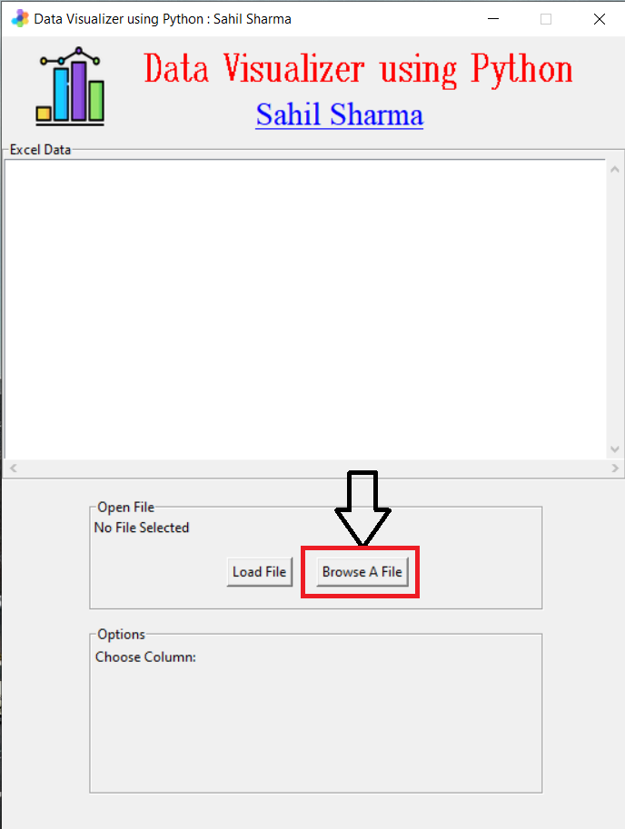
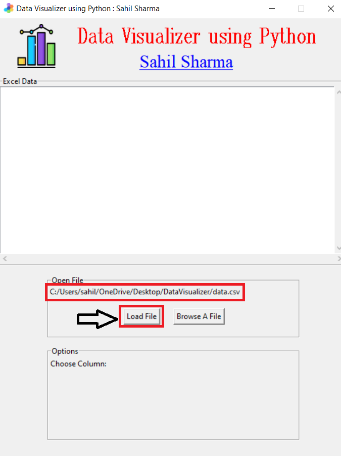
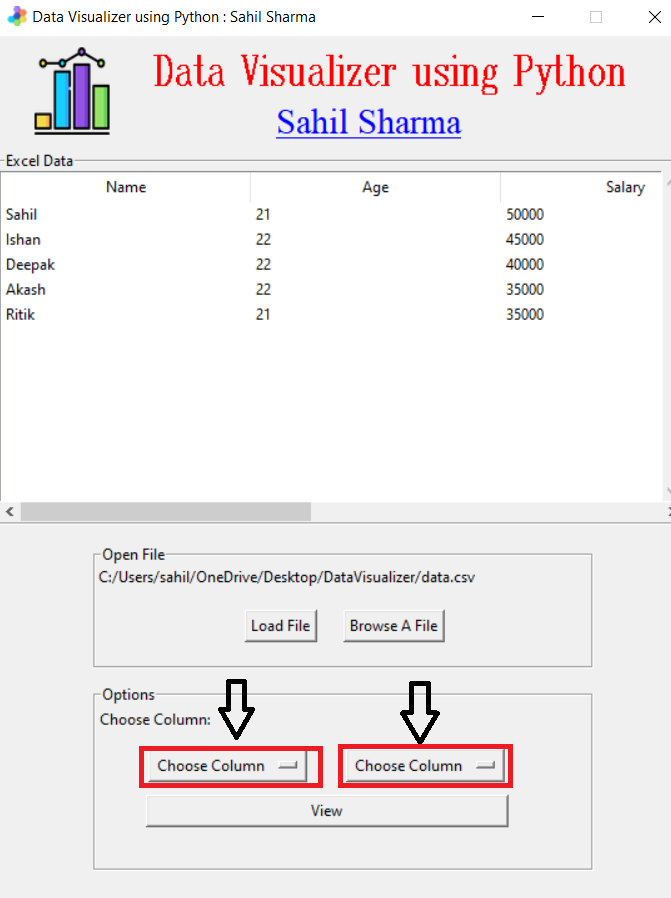
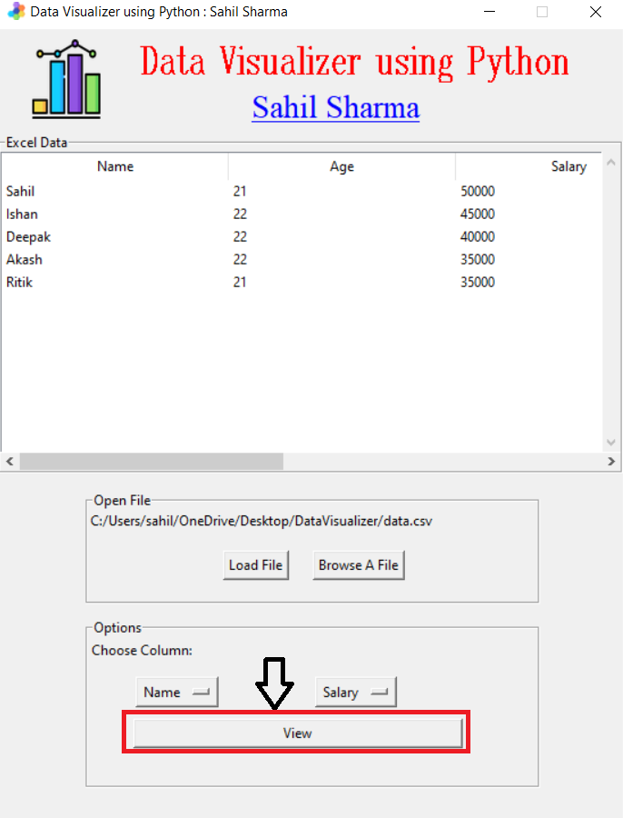
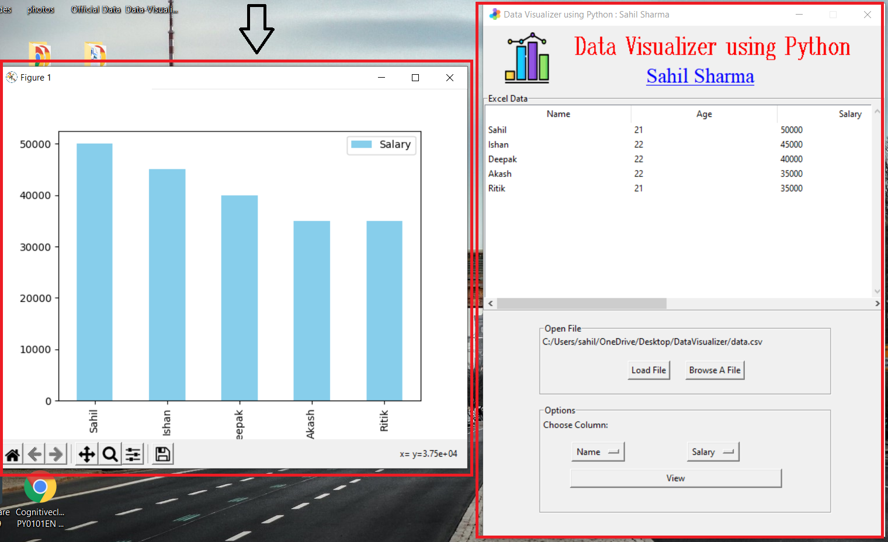

# Data-Visualizer-Using-Python-GUI
Data visual using Python GUI (Tkinter)

<h2>Screenshots</h2>
<h3>1. Browse File (csv or xlsx)</h3>
  
<h3>2. Check your file path and the load the file.</h3>
  
<h3>3. Select the columns of the file whose data you want to see.</h3>
  
<h3>4. After selecting, Click on View button.</h3>
  
<h3>5. A bar graph is displayed with the selected columns of data.</h3>

